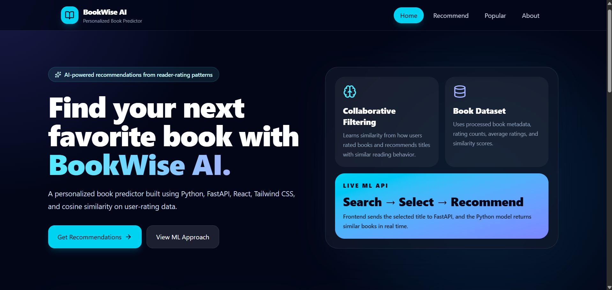
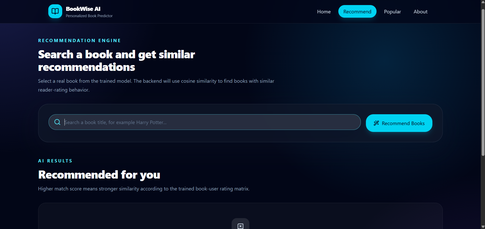
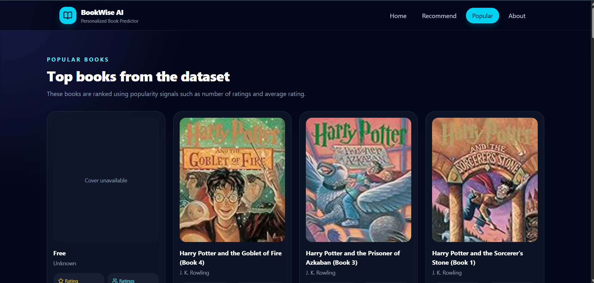
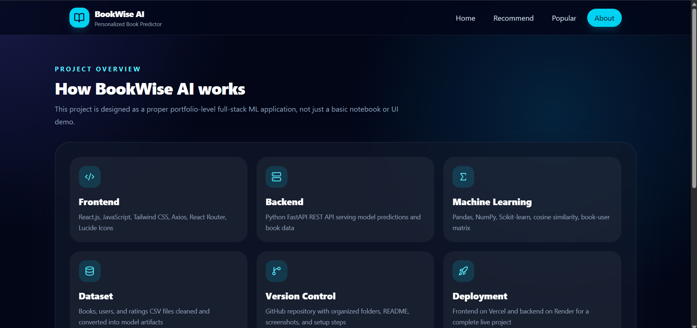
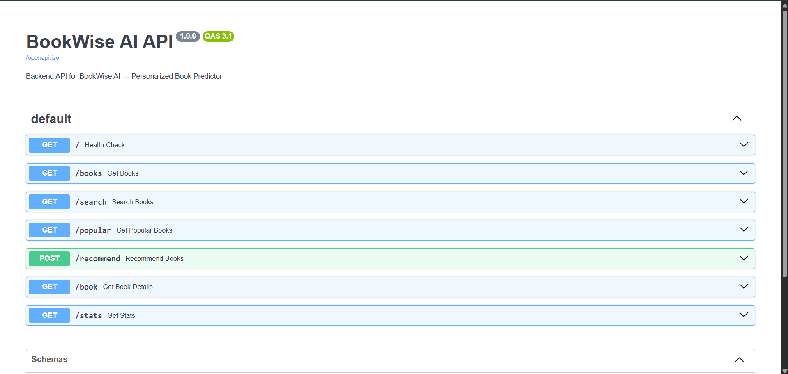

# BookWise AI — Personalized Book Predictor


BookWise AI is a full-stack machine learning web application that recommends books based on user-rating behavior. It uses collaborative filtering and cosine similarity to suggest books that are similar to a selected book.

The project includes a Python machine learning recommendation engine, a FastAPI backend API, a modern React.js frontend, and live deployment using Render and Vercel.

---

## Live Demo

**Frontend:**  
https://bookwise-ai-book-recommender-ew7un2por.vercel.app/

**Backend API:**  
https://bookwise-ai-backend.onrender.com/

**API Documentation:**  
https://bookwise-ai-backend.onrender.com/docs

> Note: The backend is hosted on Render free tier. The first request may take some time if the backend was inactive.

---

## Features

- Search books by title
- Get personalized book recommendations
- View popular books
- View book details such as title, author, year, publisher, rating, and cover image
- View cosine similarity match score
- Responsive React frontend
- REST API backend using FastAPI
- Trained machine learning model saved as `.pkl` files
- Live frontend and backend deployment

---

## Tech Stack

### Frontend

- React.js
- JavaScript
- Tailwind CSS
- Vite
- Axios
- React Router
- Lucide React

### Backend

- Python
- FastAPI
- Uvicorn
- Pydantic

### Machine Learning

- Pandas
- NumPy
- Scikit-learn
- Cosine Similarity
- Collaborative Filtering

### Deployment

- Frontend: Vercel
- Backend: Render
- Version Control: GitHub

---

## Machine Learning Approach

The recommendation system uses collaborative filtering.

The model is trained using user-book rating data. A book-user matrix is created where rows represent books and columns represent users. Cosine similarity is then applied to calculate how similar one book is to another based on user rating behavior.

A similarity score closer to `1` means the recommended book is more similar to the selected book.

```text
0.90 - 1.00  -> Very high similarity
0.60 - 0.89  -> Strong similarity
0.30 - 0.59  -> Moderate similarity
0.10 - 0.29  -> Weak similarity
0.00 - 0.09  -> Very low similarity
```

Important: the match score is not an accuracy percentage. It represents similarity between books based on rating patterns.

---

## Project Structure

```text
bookwise-ai-book-recommender/
│
├── backend/
│   ├── app/
│   │   ├── __init__.py
│   │   ├── main.py
│   │   ├── recommender.py
│   │   ├── data_loader.py
│   │   └── schemas.py
│   │
│   ├── data/
│   │   ├── .gitkeep
│   │   └── README_DATA.md
│   │
│   ├── models/
│   │   ├── .gitkeep
│   │   ├── books.pkl
│   │   ├── book_details.pkl
│   │   ├── pivot_table.pkl
│   │   ├── popular_books.pkl
│   │   └── similarity.pkl
│   │
│   ├── notebooks/
│   │   └── model_training.ipynb
│   │
│   ├── scripts/
│   │   ├── train_model.py
│   │   ├── test_recommender.py
│   │   └── api_smoke_test.py
│   │
│   ├── requirements.txt
│   ├── render.yaml
│   └── .python-version
│
├── frontend/
│   ├── src/
│   │   ├── api/
│   │   ├── components/
│   │   ├── pages/
│   │   ├── App.jsx
│   │   ├── main.jsx
│   │   └── index.css
│   │
│   ├── package.json
│   ├── vite.config.js
│   ├── vercel.json
│   └── .env.example
│
├── screenshots/
├── README.md
└── .gitignore
```

---

## API Endpoints

| Method | Endpoint | Description |
|---|---|---|
| GET | `/` | Health check |
| GET | `/books` | Get available books |
| GET | `/search?query=bookname&limit=10` | Search books |
| GET | `/popular` | Get popular books |
| POST | `/recommend` | Get book recommendations |
| GET | `/book?title=bookname` | Get book details |
| GET | `/stats` | Get model statistics |

---

## Recommendation API Example

### Request

```json
{
  "title": "Harry Potter",
  "top_n": 8
}
```

### Response

```json
{
  "selected_book": {
    "title": "Harry Potter and the Sorcerer's Stone",
    "author": "J. K. Rowling"
  },
  "recommendations": [
    {
      "title": "Harry Potter and the Chamber of Secrets",
      "author": "J. K. Rowling",
      "similarity_score": 0.413
    }
  ]
}
```

---

## Screenshots

### Home Page



### Recommendation Page



### Popular Books Page



### About Page



### API Docs



> Make sure the screenshot file names in the `screenshots/` folder match the names used above.

---

## Local Setup

### 1. Clone the Repository

```bash
git clone https://github.com/Yarram-Koushik/bookwise-ai-book-recommender.git
cd bookwise-ai-book-recommender
```

---

## Backend Setup

Go to the backend folder:

```bash
cd backend
```

Create a virtual environment:

```bash
python -m venv .venv
```

Activate the virtual environment.

Windows:

```bash
.venv\Scripts\activate
```

Mac/Linux:

```bash
source .venv/bin/activate
```

Install dependencies:

```bash
pip install -r requirements.txt
```

Run the backend server:

```bash
uvicorn app.main:app --reload
```

Backend will run at:

```text
http://127.0.0.1:8000
```

API docs will be available at:

```text
http://127.0.0.1:8000/docs
```

---

## Frontend Setup

Open another terminal and go to the frontend folder:

```bash
cd frontend
```

Install dependencies:

```bash
npm install
```

Create a `.env` file inside the `frontend/` folder:

```env
VITE_API_BASE_URL=http://127.0.0.1:8000
```

Run the frontend:

```bash
npm run dev
```

Frontend will run at:

```text
http://localhost:5173
```

---

## Model Training

The raw Kaggle dataset files are not included in this repository.

To retrain the model, download the Book Recommendation Dataset from Kaggle and place these files inside `backend/data/`:

```text
Books.csv
Ratings.csv
Users.csv
```

Then run:

```bash
cd backend
python scripts/train_model.py
```

To test the recommender from the terminal:

```bash
python scripts/test_recommender.py
```

To test whether the API can load the model correctly:

```bash
python scripts/api_smoke_test.py
```

---

## Model Artifacts

The trained model artifacts are stored inside:

```text
backend/models/
```

Files used by the backend:

```text
books.pkl
book_details.pkl
pivot_table.pkl
popular_books.pkl
similarity.pkl
```

These files are required for the deployed backend to generate recommendations.

---

## Deployment

### Backend Deployment

Backend is deployed on Render.

Render settings:

```text
Root Directory: backend
Build Command: pip install -r requirements.txt
Start Command: uvicorn app.main:app --host 0.0.0.0 --port $PORT
```

Python version used:

```text
3.11.11
```

Backend URL:

```text
https://bookwise-ai-backend.onrender.com/
```

---

### Frontend Deployment

Frontend is deployed on Vercel.

Vercel settings:

```text
Root Directory: frontend
Framework Preset: Vite
Install Command: npm install
Build Command: npm run build
Output Directory: dist
```

Environment variable used in Vercel:

```env
VITE_API_BASE_URL=https://bookwise-ai-backend.onrender.com
```

Frontend URL:

```text
https://bookwise-ai-book-recommender-ew7un2por.vercel.app/
```

---

## Important Notes

- The backend may take some time to respond on the first request because Render free services can sleep when inactive.
- Raw dataset CSV files are not pushed to GitHub.
- Trained `.pkl` model files are included because the backend needs them for live recommendations.
- Similarity score is between `0` and `1`; higher means more similar.

---

## Future Improvements

- Add user login and saved favorite books
- Add genre-based filtering
- Add content-based filtering using book descriptions
- Add hybrid recommendation model
- Add rating prediction
- Add database support instead of only `.pkl` files
- Improve book cover image quality
- Add more advanced recommendation explanations

---


## License

This project is created for learning, portfolio, and demonstration purposes.
